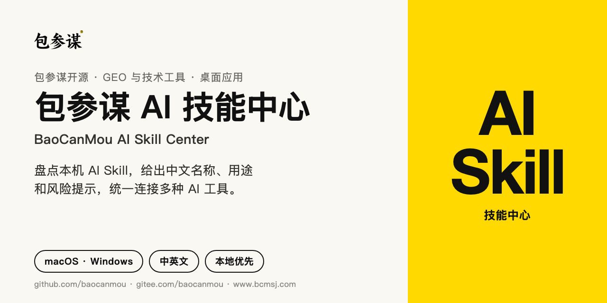
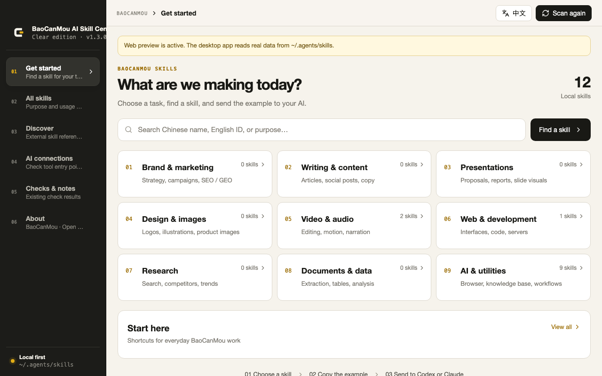
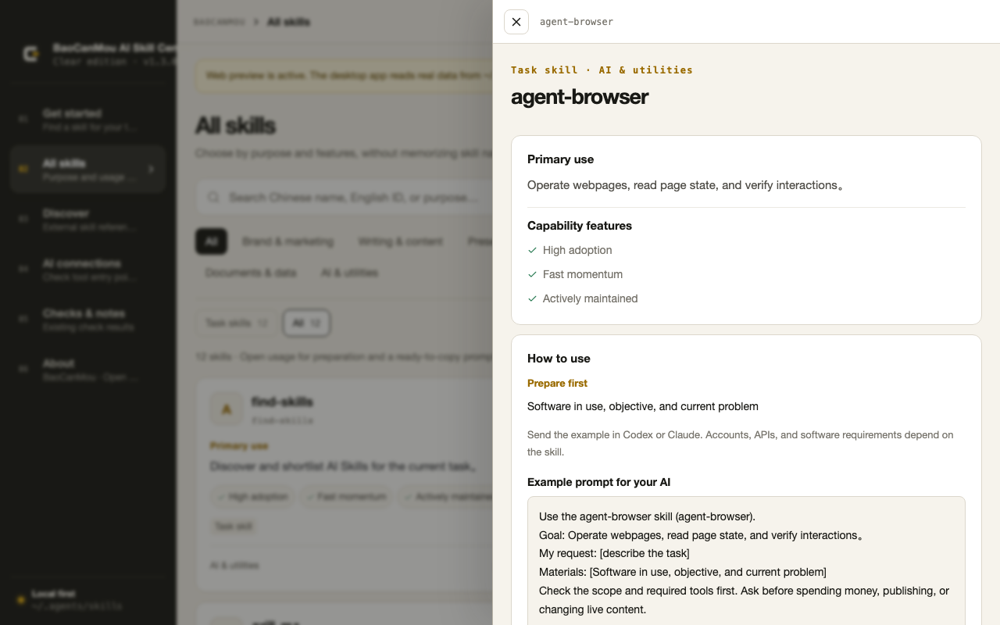
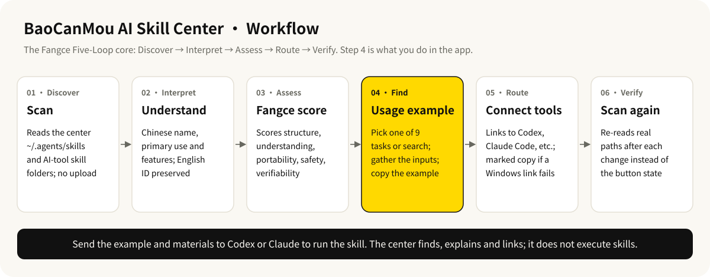

<p align="center">
  
</p>

# BaoCanMou AI Skill Center

[简体中文](README.md) · [English](README.en.md)

[](https://github.com/baocanmou/baocanmou-ai-skill-center/releases/tag/v1.4.0)
[](LICENSE)
[](https://github.com/baocanmou/baocanmou-ai-skill-center/actions/workflows/ci.yml)
[](https://gitee.com/baocanmou/baocanmou-ai-skill-center)

A macOS / Windows desktop app that turns the AI skills in your local `~/.agents/skills` into a readable bilingual catalog: find a skill by task, copy a usage example, then hand it to Codex, Claude Code, or another AI tool to run.

## Who it is for and when to use it

- **You have dozens or hundreds of local skills and can't remember their IDs**: browse by task such as "Presentations" or "Design & images", or search in plain language.
- **Several skills look alike**: each card states the primary use and features, and separates task skills, slide-image styles, UI styles, and methods.
- **You want one set of skills across several AI tools**: link the same center source to Codex, Claude Code, Gemini CLI, Cursor, Baidu Comate, Qwen Code, TRAE, and others instead of keeping copies.
- **Teammates prefer Chinese**: Chinese names and descriptions can be corrected in the app without touching the original `SKILL.md`.

## What it does

- **Find skills by task**: nine task entry points on Home (branding & marketing, writing, presentations, design & images, video & audio, web & development, research, documents & data, AI utilities), plus shortcuts for common work.
- **Understand every skill**: Chinese name plus English ID, a primary use, and up to five features; search by Chinese name, English ID, or purpose.
- **Get a ready-to-copy example**: the detail view lists what to prepare, the scope, and a bilingual request template; fill in the bracketed fields and send it to your AI.
- **See real examples**: when a skill folder ships PNG/JPG/WebP/GIF files, the detail view shows up to four; fewer than three are labeled honestly and never padded with other images.
- **Correct the Chinese text**: edits are stored only in the local `~/.baocanmou/skill-center/translations.json`.
- **Connect AI tools**: Codex, Claude Code, Gemini CLI, Cursor, Hermes, ZCode, OpenCode, Windsurf, plus Chinese coding tools Baidu Comate (文心快码), Qwen Code, and TRAE (global and TRAE CN); symlinks on macOS/Linux, and a copy with a management marker when a Windows link fails. Kimi Code CLI already reads `~/.agents/skills`, so it is shown as “Reads the center directly” and no extra link is created, which keeps each skill from loading twice. Paths per tool are listed in the [compatibility table](skills/baocanmou-ai-skill-center/references/兼容路径.md).
- **Discover external skills**: the Discover view lists public metrics, original sources, and a BaoCanMou recommendation score only. It does not bundle or automatically install third-party skills.
- **Checks & notes**: shows structural checks and static risk signals; these are not security certification.

## Examples

Both screenshots come from the web preview (`npm run dev`). A plain browser has no desktop runtime, so the app shows a "Web preview is active" notice and uses the first 12 entries of the external index [`featured-skills.json`](featured-skills.json) as demo data. The desktop app reads the real skills in your local `~/.agents/skills`.

**Home: find a skill by task**



**Skill detail: primary use, features, and a ready-to-copy example**



## Workflow



The core is the BaoCanMou-defined “Fangce Five-Loop”:

1. **Discover**: read-only inventory of the local center source and the real skill entry points of each AI tool.
2. **Interpret**: keep English IDs and invocation contracts, and generate editable Chinese names and descriptions.
3. **Assess**: compute a “Fangce score” from structure, understanding, portability, safety, and verifiability.
4. **Route**: symlinks on macOS/Linux; on Windows, links first, then a copy with a management marker if linking fails.
5. **Verify**: rescan real paths after each connection change instead of trusting a button state.

The Fangce score is not a security certification, quality promise, or user rating. See [Original Core Architecture](docs/Original-Core-Architecture.en.md) for details.

## Download and install

Download the package for your system from [Releases v1.4.0](https://github.com/baocanmou/baocanmou-ai-skill-center/releases/tag/v1.4.0):

| Package | System | Chip |
|---|---|---|
| `BaoCanMou-AI-Skill-Center_1.4.0_darwin_aarch64.dmg` | macOS | Apple silicon (M1 and later) |
| `BaoCanMou-AI-Skill-Center_1.4.0_darwin_x64.dmg` | macOS | Intel |
| `BaoCanMou-AI-Skill-Center_1.4.0_windows_x64-setup.exe` | Windows | x64 (most Intel / AMD PCs) |
| `BaoCanMou-AI-Skill-Center_1.4.0_windows_arm64-setup.exe` | Windows | ARM64 |

macOS: open the DMG and drag “包参谋 AI 技能中心” into Applications.

**First launch on macOS**: the app has an ad-hoc signature and is not notarized by Apple, so macOS may say it cannot verify the developer. To open it:

1. Double-click the app in Applications once, then click “Done” or “Cancel” on the warning.
2. Open System Settings → Privacy & Security, find the message about this app near the bottom, click “Open Anyway”, and confirm.
3. If macOS says the app “is damaged and can't be opened”, remove the download quarantine flag in Terminal, then open it again:

   ```bash
   xattr -dr com.apple.quarantine "/Applications/包参谋 AI 技能中心.app"
   ```

The Windows installers are not code-signed either. If SmartScreen shows “Windows protected your PC”, click “More info → Run anyway” to continue.

### Run from source

Requires Node.js 20+, Rust 1.77.2+, and the system dependencies for Tauri 2.

```bash
git clone https://github.com/baocanmou/baocanmou-ai-skill-center.git
# China mirror: git clone https://gitee.com/baocanmou/baocanmou-ai-skill-center.git
cd baocanmou-ai-skill-center
npm ci
npm run tauri:dev
```

Use `npm run dev` for the interface only (web preview with demo data) and `npm run check` for the full check suite. Read-only local inventory summary:

```bash
cargo run --manifest-path src-tauri/Cargo.toml -- --inspect-summary
```

## How to use

Open the app → choose a task → click “How to use” → gather what is listed under “Prepare first” → copy the example → replace the bracketed fields → send it to Codex or Claude.

The app generates examples in this format. Using `baocanmou-plan-to-ppt` as an example, the name and goal are filled in from the local skill description; the bracketed request is a fictional example:

```text
Use the baocanmou-plan-to-ppt skill (Plans into Presentations).
Goal: Turn planning materials into a sourced, editable proposal deck.
My request: [Turn this product-launch brief into a proposal of about 12 slides]
Materials: [Source material, audience, slide count, and format]
Check the scope and required tools first. Ask before spending money, publishing, or changing live content.
```

Other requests you can send directly:

```text
Use the logo-generator-skill skill. My request: [Design three SVG logo directions for a neighborhood bakery]. Check the scope and required tools first.
```

```text
Use the bcm-geo-optimizer skill. My request: [Diagnose how our brand is mentioned and cited in AI search]. Check the scope and required tools first. Ask before publishing or changing live content.
```

See the [User Guide](docs/User-Guide.en.md) for the full walkthrough.

## Boundaries

- **The app does not run skills**: it finds, explains, and links them. The AI and the software each skill needs do the actual work.
- **No upload, no automatic install**: skill content is not uploaded, and external skills are not installed automatically.
- **No deletion, no overwrite**: center-source skills are never deleted, unmanaged targets are never overwritten, and disconnecting removes only verifiable managed links or marked copies.
- **Path and size limits**: only safe single-level skill IDs are accepted, path traversal is rejected, `SKILL.md` reads are capped at 512 KB, and each preview image at 4 MB.
- **Results that need a human check**: “linked to the shared source” does not mean the current AI session has loaded the skill; “structure passed” does not mean dependencies and accounts are configured; external skills still need their source, license, dependencies, permissions, and quality reviewed before use. Connecting or disconnecting changes the target AI's skill entries, so confirm the impact first.

## FAQ

**The connection succeeded, but my AI can't find the skill.**
Start a new session in that tool, request the skill by its exact English ID, then check the entry and required tools. An independent entry is not necessarily a broken skill.

**The Chinese description is wrong. How do I fix it?**
Expand “Chinese text & editing” in the skill detail and click edit. Changes are written only to the local translation file, never to the original skill.

**Will skills in Discover be installed on my computer?**
No. Discover is an external index with recommendation scores. It does not mean the skill exists locally and never installs anything.

**Why does the web preview show only 12 skills?**
`npm run dev` runs in a plain browser that cannot read local files, so it uses the first 12 entries of `featured-skills.json` as a demo. The desktop app reads every skill in `~/.agents/skills`.

**I installed a new skill, but the list hasn't changed.**
Click “Scan again” in the top-right corner.

## Versions and updates

Current version **v1.4.0** (2026-10-05): Adds Chinese AI coding tools. Baidu Comate, Qwen Code, TRAE, and TRAE CN can be linked to the shared skills; Kimi Code CLI is recognized as reading the center directly, so no duplicate link is made. The previous release, v1.3.0 (2026-09-30), introduced task-based entry points and bilingual request templates for every skill.

- Changelog: [CHANGELOG.md](CHANGELOG.md) · [Chinese changelog](docs/CHANGELOG.zh.md)
- All versions: [Releases](https://github.com/baocanmou/baocanmou-ai-skill-center/releases)

## License and attribution

BaoCanMou-authored project code is licensed under the [MIT License](LICENSE). The “包参谋 / BaoCanMou” name, `www.bcmsj.com`, and the project graphic mark are not licensed as brands with the code. The app icon and in-product mark are generated from the original vector master [`src/assets/baocanmou-mark.svg`](src/assets/baocanmou-mark.svg).

General dependencies such as React and Tauri remain under their own licenses; see [THIRD_PARTY_NOTICES.md](THIRD_PARTY_NOTICES.md). Repositories and skills referenced by the capability index belong to their respective rights holders and are referenced as an index only. See the [IP Boundary](docs/Intellectual-Property-Boundary.en.md).

Copyright © 2026 BaoCanMou contributors.

## Other BaoCanMou open-source projects

| Project | What it does | China mirror |
|---|---|---|
| [Restaurant Slogans: 10 Methods, 3 Picks](https://github.com/baocanmou/baocanmou-restaurant-slogan) | One restaurant tagline per method from ten masters, then three recommendations | [Gitee](https://gitee.com/baocanmou/baocanmou-restaurant-slogan) |
| [Plans into Presentations](https://github.com/baocanmou/baocanmou-plan-to-ppt) | Turns briefs and research into an editable, source-checked proposal deck | [Gitee](https://gitee.com/baocanmou/baocanmou-plan-to-ppt) |
| [BCM GEO Outcome Engine](https://github.com/baocanmou/bcm-geo-optimizer) | Diagnoses brand mentions, citations and recommendations in AI search | [Gitee](https://gitee.com/baocanmou/bcm-geo-optimizer) |
| [Open GEO SEO Console](https://github.com/baocanmou/open-geo-seo-console) | Self-hosted SEO and GEO monitoring console | [Gitee](https://gitee.com/baocanmou/open-geo-seo-console) |

## About BaoCanMou

BaoCanMou (包参谋) — Nanchang BaoCanMou Brand Planning Co., Ltd. — is a brand strategy and design company founded in 2012 in Nanchang, Jiangxi, China. We provide brand positioning, logo and visual identity, packaging, brand space and communication content, mainly for restaurants, chain stores, packaged food and regional specialty brands. Founder: Yi Huiting. Website: [www.bcmsj.com](https://www.bcmsj.com).

We work positioning first, design second. These tools come from work we repeat in client projects; we write the judgment criteria down so AI can follow the same standard.
