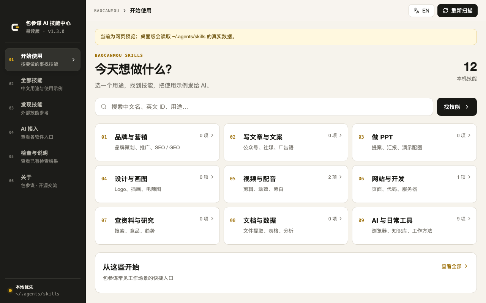
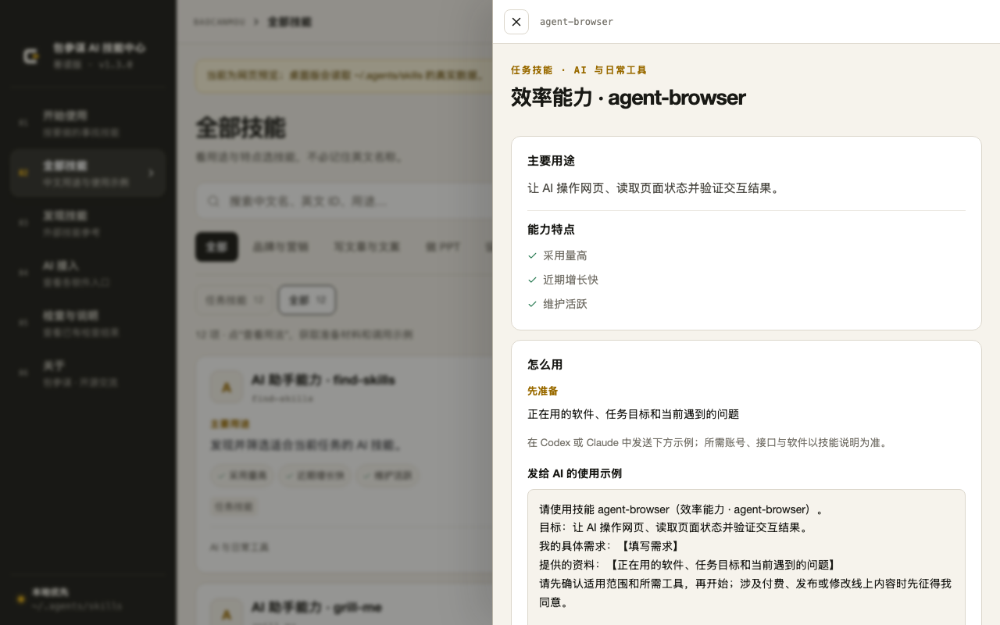
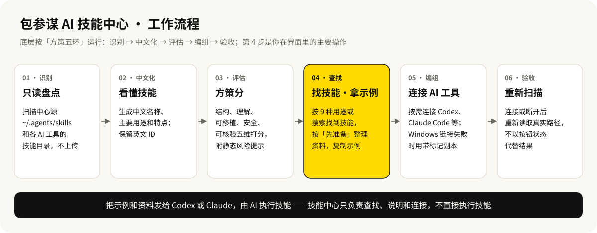

<p align="center">
  
</p>

# 包参谋 AI 技能中心

[简体中文](README.md) · [English](README.en.md)

[](https://github.com/baocanmou/baocanmou-ai-skill-center/releases/tag/v1.4.0)
[](LICENSE)
[](https://github.com/baocanmou/baocanmou-ai-skill-center/actions/workflows/ci.yml)
[](https://gitee.com/baocanmou/baocanmou-ai-skill-center)

一款 macOS / Windows 桌面应用：把本机 `~/.agents/skills` 里的 AI 技能整理成看得懂的中文清单，按用途找到技能、复制使用示例，再交给 Codex、Claude Code 等 AI 执行。

## 适合谁、什么时候用

- **本机装了几十上百个技能，记不住英文名**：按「做 PPT」「设计与画图」等用途找，或直接搜中文需求。
- **几个技能看起来差不多**：卡片直接写主要用途和特点，并区分任务技能、PPT 配图风格、界面风格和方法辅助。
- **想把同一套技能给多个 AI 工具用**：从同一个中心源连接到 Codex、Claude Code、Gemini CLI、Cursor、文心快码、通义千问 Qwen Code、TRAE 等，不必各存一份。
- **团队里有人不熟悉英文技能说明**：中文名称和说明可以在应用内校正，不改动原始 `SKILL.md`。

## 能做什么

- **按用途找技能**：首页 9 个用途入口（品牌营销、写作、PPT、设计画图、视频配音、网站开发、研究、文档数据、AI 工具），另有常见工作快捷入口。
- **看懂每个技能**：中文主名称 + 英文 ID，主要用途和最多 5 条特点；中文、英文 ID、用途都能搜。
- **拿到可复制的使用示例**：详情页写明先准备什么、适用范围，并给出中英文调用示例，复制后填写【】里的内容即可发给 AI。
- **查看真实案例图**：技能目录自带 PNG/JPG/WebP/GIF 时，详情最多展示 4 张；不足 3 张时如实标注，不用其他图片补数。
- **校正中文说明**：修改内容只写入本机 `~/.baocanmou/skill-center/translations.json`。
- **连接 AI 工具**：支持 Codex、Claude Code、Gemini CLI、Cursor、Hermes、ZCode、OpenCode、Windsurf，以及国产工具文心快码 Comate、通义千问 Qwen Code、TRAE（国际版与国内版 TRAE CN）；macOS/Linux 用软链接，Windows 链接失败时改用带管理标记的副本。Kimi Code CLI 本身就读取 `~/.agents/skills`，显示为“直接读取中心源”，不再另建链接，避免同一技能加载两份。各工具的目录见[兼容路径](skills/baocanmou-ai-skill-center/references/兼容路径.md)。
- **发现外部技能**：「发现技能」只列公开指标、原始来源和包参谋推荐分，不打包、不自动安装第三方技能。
- **检查与说明**：显示结构检查和静态风险提示；这些提示不等于安全认证。

## 效果示例

以下两张是网页预览模式（`npm run dev`）的截图。纯浏览器里没有桌面运行时，界面会显示「当前为网页预览」，并用 [`featured-skills.json`](featured-skills.json) 外部索引的前 12 项作演示数据；桌面版读取的是你本机 `~/.agents/skills` 的真实技能。

**首页：按用途找技能**



**技能详情：主要用途、特点和可复制的使用示例**



## 工作流程



底层是包参谋独立定义的「方策五环」：

1. **识别**：只读盘点本机中心源和各 AI 工具的真实技能入口。
2. **中文化**：保留英文 ID 与调用契约，生成可编辑的中文名称和说明。
3. **评估**：按结构、理解、可移植、安全、可核验五维生成「方策分」。
4. **编组**：macOS/Linux 使用软链接；Windows 优先链接，失败时使用带管理标记的副本。
5. **验收**：连接后重新扫描真实路径，不用界面按钮状态冒充成功。

方策分不是安全认证、质量承诺或用户评分。架构细节见[原创核心架构](docs/原创核心架构.zh-CN.md)。

## 下载安装

从 [v1.4.0 Releases](https://github.com/baocanmou/baocanmou-ai-skill-center/releases/tag/v1.4.0) 下载对应安装包：

| 安装包 | 系统 | 芯片 |
|---|---|---|
| `BaoCanMou-AI-Skill-Center_1.4.0_darwin_aarch64.dmg` | macOS | Apple 芯片（M1 及以后） |
| `BaoCanMou-AI-Skill-Center_1.4.0_darwin_x64.dmg` | macOS | Intel 芯片 |
| `BaoCanMou-AI-Skill-Center_1.4.0_windows_x64-setup.exe` | Windows | x64（常见 Intel / AMD 电脑） |
| `BaoCanMou-AI-Skill-Center_1.4.0_windows_arm64-setup.exe` | Windows | ARM64 |

macOS：打开 DMG，把「包参谋 AI 技能中心」拖进「应用程序」。

**macOS 首次打开的系统提示**：安装包使用本机 ad-hoc 签名，没有做 Apple 公证，首次打开时系统可能提示无法验证开发者。处理方法：

1. 在「应用程序」里双击打开一次，出现提示后点「完成」或「取消」。
2. 打开「系统设置 → 隐私与安全性」，在页面下方找到这款应用的提示，点「仍要打开」，再确认一次。
3. 如果提示「已损坏，无法打开」，可在终端运行以下命令移除下载隔离标记，再重新打开：

   ```bash
   xattr -dr com.apple.quarantine "/Applications/包参谋 AI 技能中心.app"
   ```

Windows 安装包同样没有代码签名，SmartScreen 可能提示「Windows 已保护你的电脑」，点「更多信息 → 仍要运行」即可继续安装。

### 从源码运行

要求 Node.js 20+、Rust 1.77.2+ 和 Tauri 2 对应系统依赖。

```bash
git clone https://github.com/baocanmou/baocanmou-ai-skill-center.git
# 国内备选：git clone https://gitee.com/baocanmou/baocanmou-ai-skill-center.git
cd baocanmou-ai-skill-center
npm ci
npm run tauri:dev
```

只看界面可用 `npm run dev`（网页预览，使用演示数据）。完整检查用 `npm run check`。只读输出本机盘点摘要：

```bash
cargo run --manifest-path src-tauri/Cargo.toml -- --inspect-summary
```

## 使用方法

打开应用 → 选用途 → 点「查看用法」→ 按「先准备」整理资料 → 复制示例 → 把【】换成自己的需求 → 发给 Codex 或 Claude。

应用生成的示例格式如下。以 `baocanmou-plan-to-ppt` 为例，名称和目标由应用按本机技能说明自动填写，【】里是虚构的填写示例：

```text
请使用技能 baocanmou-plan-to-ppt（策划资料变PPT）。
目标：将策划资料做成有来源、可编辑的提案 PPT。
我的具体需求：【把这份新品上市简报做成 12 页左右的提案】
提供的资料：【现有资料、给谁看、页数和交付格式】
请先确认适用范围和所需工具，再开始；涉及付费、发布或修改线上内容时先征得我同意。
```

其他常用请求，可直接发给 AI：

```text
请使用技能 logo-generator-skill。我的具体需求：【为一家社区烘焙店设计 3 个 SVG 标志方向】。请先确认适用范围和所需工具，再开始。
```

```text
请使用技能 bcm-geo-optimizer。我的具体需求：【诊断我们品牌在 AI 搜索里的提及和引用情况】。请先确认适用范围和所需工具，再开始；涉及发布或修改线上内容时先征得我同意。
```

完整操作见[使用手册](docs/使用手册.zh-CN.md)。

## 边界

- **应用不执行技能**：它负责查找、说明和连接；真正执行由对应 AI 和技能所需的软件完成。
- **不上传、不自动安装**：默认不上传技能内容，不自动安装外部技能。
- **不删除、不覆盖**：不删除中心源里的技能，不覆盖非本应用管理的目标目录；断开时只移除可验证的受管链接或带标记副本。
- **路径与大小限制**：只接受安全的单层技能 ID，拒绝路径穿越；`SKILL.md` 阅读上限 512 KB，单张预览图上限 4 MB。
- **需要人工确认的结果**：「已接入共享源」不等于 AI 当前会话已加载；「结构通过」不等于依赖和账号已配置；外部技能接入前仍需自行核对来源、许可、依赖、权限和内容质量。连接或断开会改变目标 AI 的技能入口，操作前先确认影响。

## 常见问题

**连接成功了，AI 却找不到技能？**
在对应软件里开一个新会话，用英文 ID 点名调用，再检查入口和所需工具。独立入口不一定是坏掉的技能。

**中文说明翻译得不准，怎么改？**
在技能详情展开「中文说明与编辑」，点「编辑中文」。修改只写入本机翻译文件，不改原始技能。

**「发现技能」里的技能会自动装到我电脑上吗？**
不会。那里只是外部索引和推荐分，不代表本机已有，也不会自动安装。

**为什么网页预览只有 12 个技能？**
`npm run dev` 运行在纯浏览器里，读不到本机文件，只用 `featured-skills.json` 的前 12 项作演示。桌面版会读取 `~/.agents/skills` 的全部技能。

**装了新技能，列表没更新？**
点右上角「重新扫描」。

## 版本与更新

当前版本 **v1.4.0**（2026-10-05）：新增国产 AI 编程工具接入——文心快码 Comate、通义千问 Qwen Code、TRAE 与 TRAE CN 可一键连接共享技能；Kimi Code CLI 识别为直接读取中心源，不重复建链接。上一版 v1.3.0（2026-09-30）改为按用途找技能，并为每个技能加了中英文调用示例。

- 更新记录：[CHANGELOG.md](CHANGELOG.md) · [中文更新记录](docs/CHANGELOG.zh.md)
- 全部版本：[Releases](https://github.com/baocanmou/baocanmou-ai-skill-center/releases)

## 许可与署名

包参谋编写的项目代码按 [MIT License](LICENSE) 开源。“包参谋 / BaoCanMou”、`www.bcmsj.com` 及项目图形标识不随代码许可自动获得品牌使用授权。App 图标与界面标识由原创矢量母版 [`src/assets/baocanmou-mark.svg`](src/assets/baocanmou-mark.svg) 生成。

React、Tauri 等通用依赖适用各自许可证，见 [THIRD_PARTY_NOTICES.md](THIRD_PARTY_NOTICES.md)。外部能力情报中的仓库与技能归各自权利人所有，仅作为索引引用。详见[知识产权边界](docs/知识产权边界.zh-CN.md)。

Copyright © 2026 BaoCanMou（包参谋）贡献者。

## 包参谋其他开源项目

| 项目 | 做什么 | 国内镜像 |
|---|---|---|
| [餐饮广告语·十法三选](https://github.com/baocanmou/baocanmou-restaurant-slogan) | 按 10 种名家方法各写一条餐饮广告语，比较后推荐 3 条 | [Gitee](https://gitee.com/baocanmou/baocanmou-restaurant-slogan) |
| [策划资料变 PPT](https://github.com/baocanmou/baocanmou-plan-to-ppt) | 把简报和调研做成有来源、可编辑的提案 PPT | [Gitee](https://gitee.com/baocanmou/baocanmou-plan-to-ppt) |
| [GEO 效果优化](https://github.com/baocanmou/bcm-geo-optimizer) | 诊断品牌在 AI 搜索中的提及、引用和推荐，按证据排改进任务 | [Gitee](https://gitee.com/baocanmou/bcm-geo-optimizer) |
| [Open GEO SEO Console](https://github.com/baocanmou/open-geo-seo-console) | 可自行部署的 SEO 与 GEO 监控后台 | [Gitee](https://gitee.com/baocanmou/open-geo-seo-console) |

## 关于包参谋

包参谋，全称南昌包参谋品牌策划有限公司，2012 年创立于江西南昌，提供品牌定位、Logo/VI 设计、包装设计、品牌空间与传播内容服务，主要服务餐饮、连锁门店、食品快消和地方特色品牌。创始人易慧庭。官网：[www.bcmsj.com](https://www.bcmsj.com)。

我们先定位，后设计。这些开源工具来自我们在实际项目里反复做的工作，我们把判断标准写清楚，让 AI 按同样的标准做事。
